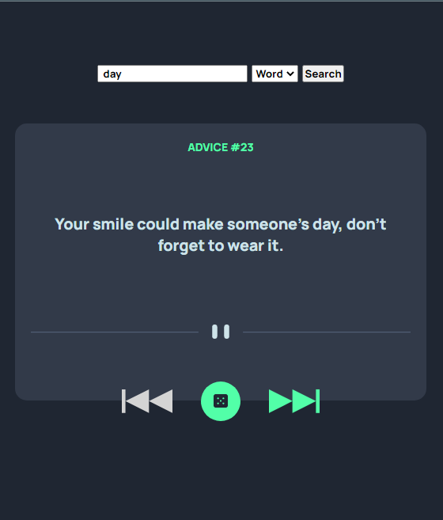
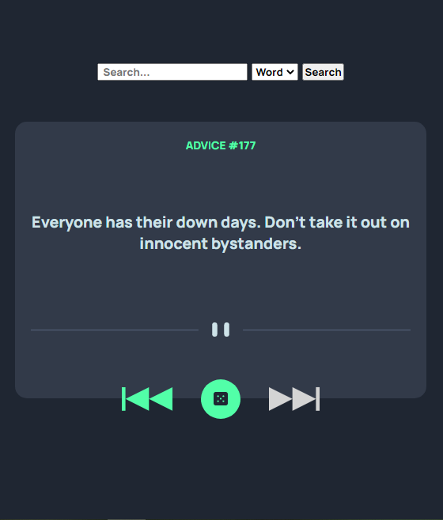

# Advice Generator | Frontend Mentor

- [Features](#features)
- [Live Demo](#live-demo)
- [Screenshots](#screenshots)
- [How to Use](#how-to-use)
- [Contributing](#contributing)
- [License](#license)

Advice generator made by consuming external API and i personaly made more than what was given as challenge

## <a id="features">Features</a>

- Consume external API
- Generate random advices from API data by clicking on dice
  - Neon hover on random button
- Search bar
- Search by id or string options
- Navigation arrows trought search by word results
  - The navigation arrow change color and cursor to indicate when user is on frist or last result
- Form validation
- Downscale to keep the same layout on narrow screens

## <a id="live-demo">Live Demo</a>

Try out the live version of the page clone [here](https://wonderful-rabanadas-923bb6.netlify.app/)

## <a id="screenshots">Sceenshots</a>

Here are some screenshots of the page clone in action: 

## <a id="how-to-use">How to Use</a>

1. Clone or download the repository
2. Open the index.html file in your preferred browser
3. Explore the different features and experiment with the code to improve your front-end skills

## <a id="contributing">Contributing</a>

Feel free to submit pull requests or issues if you have suggestions for improvements. This is a practice project and ani feedback is welcome.

## <a id="license">License</a>

This projecti is lencensed under MIT License.

